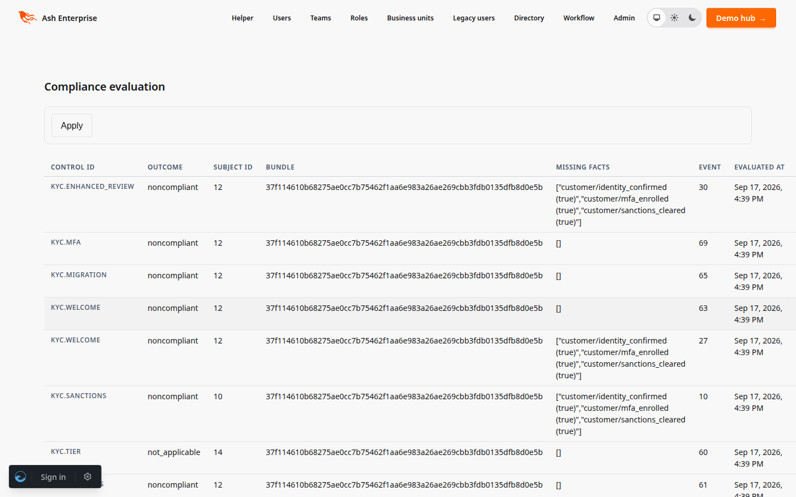

<!--
SPDX-FileCopyrightText: 2026 Luke Galea
SPDX-License-Identifier: MIT
-->

# AshRules

**Compliance programs fail in the gap between the policy document and the code
that enforces it.** The policy says "active regulated customers require valid
KYC"; the enforcement is a handful of scattered `if`s, each one a private
interpretation, none of them versioned, none of them able to answer the
auditor's actual question: *which rules produced this finding, from which
facts, under which revision?*

**AshRules closes that gap by making rules data.** A rule set is a Spark DSL
that compiles to an immutable, content-hashed bundle of serializable IR — no
quoted AST, no `Code.eval`, nothing that can't be hashed, signed, shipped to a
tenant control plane, decoded years later and evaluated identically. Evaluation
produces findings with full provenance over a five-value outcome lattice where
*missing data is never a pass*.

---

## The idea in thirty seconds

```elixir
defmodule MyApp.Compliance.Rules do
  use AshRules

  fact_schema do
    fact :status, :atom, one_of: [:active, :suspended]
    fact :jurisdiction, :atom
    fact :has_valid_kyc, :boolean, missing: :unknown
  end

  rule "active regulated customer requires valid KYC",
    id: "kyc.valid_required",
    severity: :medium do
    when_requires has(:customer, :status, :active),
                  has(:customer, :jurisdiction, :regulated)
    fails_when neg(:customer, :has_valid_kyc, true)
    outcome :noncompliant, gap: "kyc.valid_required"
  end
end

bundle = MyApp.Compliance.Rules.__bundle__()

{:ok, result} =
  AshRules.evaluate(bundle, [
    {:customer, :status, :active},
    {:customer, :jurisdiction, :regulated}
  ])

result.overall
#=> :unknown
```

That last line is the whole philosophy. No `has_valid_kyc` fact was supplied,
and the schema declares it `missing: :unknown` — so the requirement is
**unknown**, not noncompliant and not compliant. Absence of data never becomes
a violation, and never becomes a pass. Every compliance framework's ugliest
failures start with a boolean somewhere deciding that "we don't know" means
"fine".

## How it fits

AshRules owns the rule language and the evaluation. It does not own storage,
events, or the compliance program around them — the packages downstream of it
do:

```
        ┌─────────────────────────────────────────────────────┐
        │  use AshRules                    (compile time)     │
        │  rule set DSL ──verify──► immutable IR bundle       │
        │                            SHA-256 content hash     │
        └────────────────────────────┬────────────────────────┘
                                     │  JSON in both directions
                                     ▼
        ┌─────────────────────────────────────────────────────┐
        │  AshRules.evaluate(bundle, facts)    (runtime)      │
        │                                                     │
        │    Evaluator.Direct  ← default, zero deps           │
        │    Evaluator.Wongi   ← optional Rete adapter        │
        │         (same behaviour, same results)              │
        │                                                     │
        │  ⇒ Result: per-rule outcomes, provenance,           │
        │    derived + missing facts, bundle hash             │
        └────────────────────────────┬────────────────────────┘
                                     │
        ┌────────────────────────────▼────────────────────────┐
        │  hosts and ash_compliance                           │
        │  store the bundle as an approved artifact, project  │
        │  results into findings, pin every decision to the   │
        │  hash that produced it                              │
        └─────────────────────────────────────────────────────┘
```

The seam is deliberate: everything above the line is rules-as-data, everything
below decides what to do with the answers. Swap the evaluator without touching
a rule; version a rule set without touching an evaluator.

## What ships

* **Serializable rule IR** (`AshRules.Ir`) — rules, fact schemas, bundles as
  plain data. `AshRules.Ir.decode/1` validates on admission with the *same
  verifiers the DSL applies at compile time*: unknown predicates, type
  mismatches, unbound variables, missing outcomes — a refusal is a refusal no
  matter which door the rules came through. Every bundle carries a SHA-256
  content hash over canonical JSON; results pin the hash, so a finding always
  names the exact rules that produced it.
* **An outcome lattice** (`AshRules.Outcome`) — `compliant`, `noncompliant`,
  `not_applicable`, `unknown`, `error`. `unknown` and `error` never collapse to
  `compliant`; the property suite asserts it, not just this page.
* **XACML-derived combining** (`AshRules.Combining`) — `deny_overrides`
  (default), `permit_overrides`, `first_applicable`, `only_one_applicable`,
  each covered by full truth tables over the lattice.
* **Compile-time verification** — the Cedar pattern: validate before activate,
  never at evaluation. Tenant-authored rules enter as decoded IR and pass the
  identical checks.
* **One evaluator behaviour, two engines** — `AshRules.Evaluator.Direct`
  (pure Elixir, zero dependencies, deterministic by construction) and
  `AshRules.Evaluator.Wongi` (compiles the IR to Wongi.Engine rules with full
  truth maintenance). Both produce identical results on the same inputs; the
  contract is enforced by the test suite, not by optimism.

## What evaluation produces

An `AshRules.Result` per bundle evaluation:

* one **requirement** per rule: outcome, severity, gap (the combining
  metadata), rendered message, variable bindings;
* **provenance**: the working-memory facts each fired requirement consumed,
  and the ground probes checked against absence — the auditor's chain from
  rule revision to control mapping to consumed facts;
* **derived facts** — findings materialized as triples, deterministic and
  index-stable;
* **missing facts** — the absences the schema says must be surfaced;
* the **overall outcome** under the bundle's combining algorithm, plus the
  bundle hash, both revisions, and the evaluation seed.

## Rules as data, on screen

The reference integration (customer KYC compliance, in `ash_enterprise`) runs
these rules over a real event log and projects the results into findings. The
screenshots are that integration, unmodified:


Every row's explanation is the rule's own message or the missing-fact summary,
projected at evaluation time. The outcome lattice is visible in the status
column: *unknown* sits between compliant and noncompliant and never collapses
into either.


A rule set is a revision with a lifecycle (draft → validated → approved →
active) and a layer that decides what may waive or replace it. The audit row
below the two active baselines is revision 2 of the baseline, seeded as a
draft: activating it is a reviewed act, not a deploy.



Each evaluation records the bundle hash that produced it, the fact snapshot
hash, and what was missing. Replay the same events and the evaluations are
byte-identical — that is the acceptance bar, asserted by the test suite.

## Installation

Not yet on Hex. As a git dependency:

```elixir
defp deps do
  [
    {:ash_rules, github: "lukegalea/ash_rules"}
  ]
end
```

Wongi.Engine is an **optional** dependency. Add `{:wongi_engine, "~> 0.9"}` to
your own deps to get the Rete adapter; without it, everything else works and
`AshRules.Evaluator.Wongi` is a stub returning
`{:error, :wongi_not_available}`. `AshRules.Evaluator.Direct` — the default —
needs nothing beyond `ash`, `spark` and `jason`.

`mix igniter.install ash_rules` handles the formatter wiring.

## Documentation

- [Rules and fact schemas](documentation/topics/rules-and-fact-schemas.md) —
  the DSL, absence semantics, variables, metadata.
- [Evaluators](documentation/topics/evaluators.md) — the behaviour, the two
  engines, parity and determinism contracts.
- [What it refuses](documentation/topics/what-it-refuses.md) — the compile-time
  and admission-time refusals, verbatim.

## Status

0.1.0. The IR, DSL, verifiers, both evaluators and the combining algorithms are
exercised by golden tests, full combining truth tables, determinism runs
(n=50), StreamData properties over random fact sets, and a direct-vs-Wongi
parity corpus. The reference integration (customer KYC compliance) lives in
`ash_enterprise`; `ash_compliance` builds its control plane and projector on
this package's IR and evaluator behaviour.

## Contributing

Issues and PRs at [github.com/lukegalea/ash_rules](https://github.com/lukegalea/ash_rules).
`mix compile --warnings-as-errors`, `mix test`, `mix format --check-formatted`
and `mix credo --strict` must pass; CI runs all four.

Agents: read [AGENTS.md](AGENTS.md) before you change this repository. It links the agent constitution (`AGENT_PRINCIPLES.md`).

## License

MIT.
